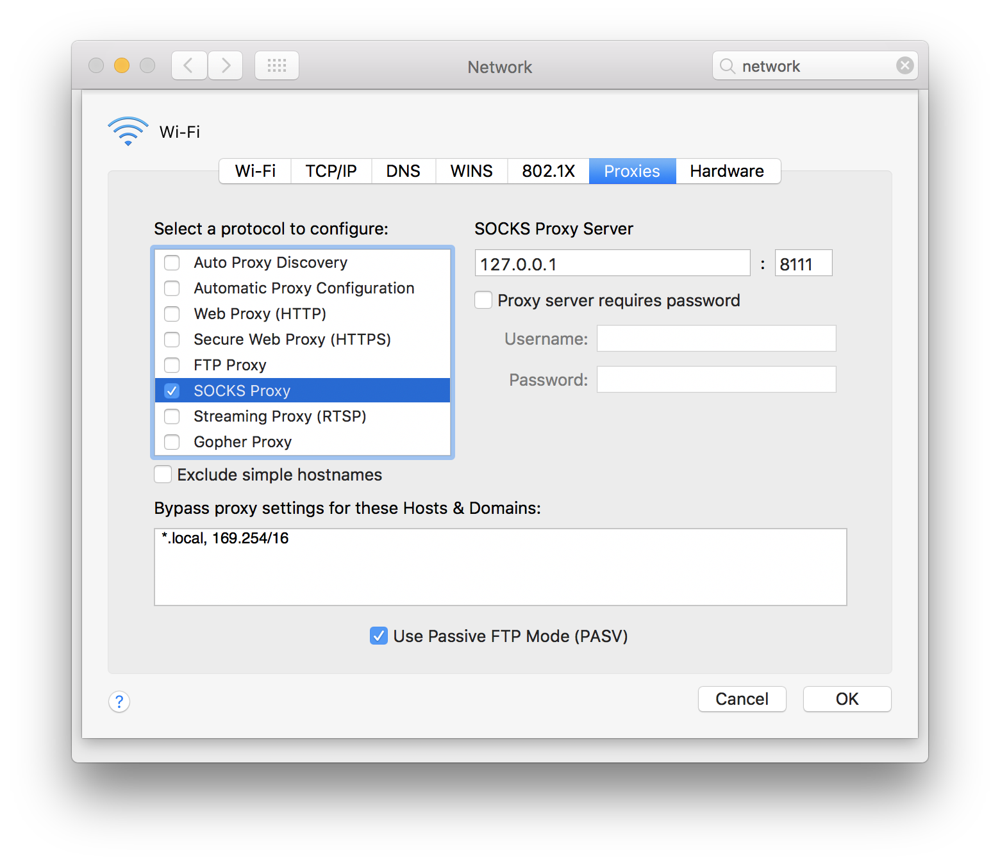
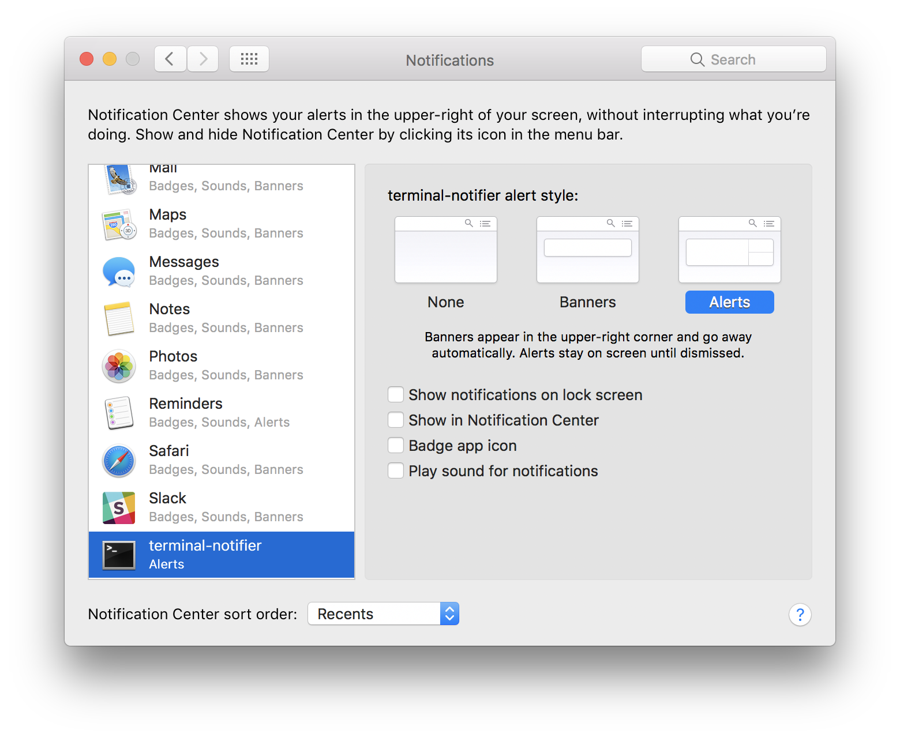

# Overview

Bash commands for macOS.

## Requirements

```sh
brew install terminal-notifier \
             dtach \
             fswatch
```

Set the `PATH` to include the `bin` directory.


## sshvpn and myvpn-service

`sshvpn` sets the macOS preferences to use a SOCKS proxy at
`127.0.0.1:PORT` (e.g. PORT=8111). Next, `sshvpn` establishes a ssh
connection to a remote host with the SOCKS port forwarding option,
tunneling traffic through `127.0.0.1:8111`. `sshvpn` disables the
macOS SOCKS proxy when ssh is terminated with `Ctrl-c`.

Add host to `~/.ssh/config`:

```text
Host myserver
  Hostname        <IP_ADDRESS>
  IdentityFile    ~/.ssh/<ID_FILE>
  UseKeychain     yes
  AddKeysToAgent  yes
  User            <USER>
  Port            <PORT>
```

### Examples

```sh
sshvpn myserver 8111
```

The service has the host and port set, and it uses `dtach` to put it
into the background.

```sh
myvpn-service
```

`sshvpn` should set the network preferences as follows.




## alarm

`alarm` uses iTunes and the macOS voice as an alarm. First, create an
iTunes playlist titled "Alarm" and add songs to it. The "Alarm"
playlist will be used. Configure `alarm-cron`.

### Schedule alarm

```sh
crontab -e
```

```sh
#min    hour    mday    month   wday    command
30      7       *       *       *       /path/to/bin/alarm-cron
```

### Turn off alarm

```sh
ps aux | grep alarm
# see what the alarm pid is
kill ALARM_PID
```

## pomodoro

`pomodoro` displays a macOS notification after `X` minutes as a
reminder to take a beak.

* Set *alert style* to "Alerts" instead of "Banners".
* Uncheck all other options.



### Examples

```sh
pomodoro 20
```

To run it in the background:

```sh
pomodoro-service
# or
pomodoro-service 20
```
